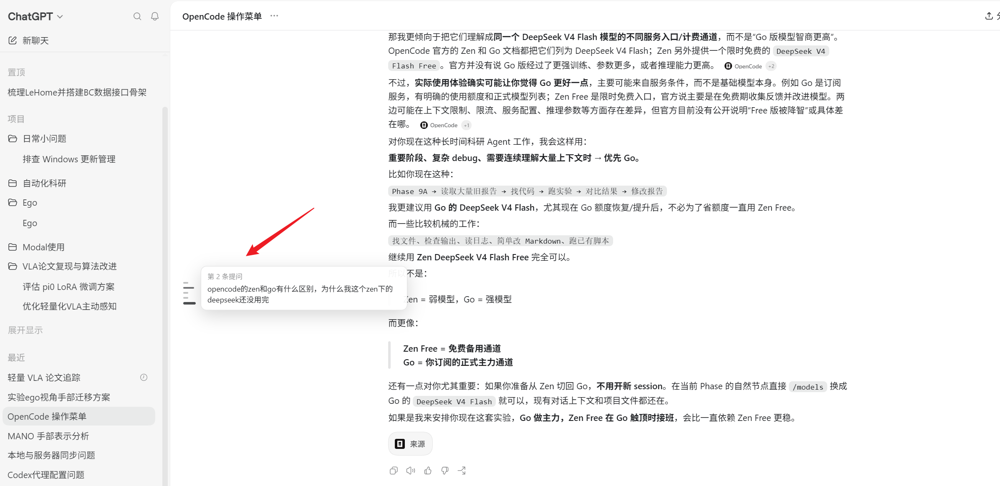

# ChatGPT Message Navigator for Codex++

为 Codex Desktop 的 **ChatGPT 模式**补充类似 Codex 对话页的灰色消息导航条。

## 演示



## 功能

- 自动为当前长对话中的每条用户提问生成导航节点
- 点击节点立即跳转到对应消息
- 悬停灰色导航条展开完整历史面板`n- 历史面板显示更多提问，并支持鼠标滚轮与拖动滚动条`n- 悬停单个节点显示提问摘要
- 自动高亮当前阅读位置
- 新消息出现后自动更新
- 仅在 ChatGPT 模式显示，不与 Codex 原生导航条重叠
- 不修改聊天记录，不创建对话分支

## 环境要求

- Windows 版 Codex Desktop
- [Codex++](https://github.com/BigPizzaV3/CodexPlusPlus) 用户脚本管理功能

已验证环境：Codex Desktop `26.814.5167`、Codex++ `1.2.47`。

## 安装

### Codex++ 脚本市场

市场合并后，可在 Codex++ 的脚本市场中搜索 **ChatGPT Message Navigator** 并安装。

### 手动安装

1. 下载 [`chatgpt-message-navigator.js`](./chatgpt-message-navigator.js)。
2. 将文件放入：

   ```text
   %APPDATA%\Codex++\user_scripts\
   ```

3. 在 Codex++ 用户脚本页面启用该脚本。
4. 重新加载 Codex，切换到 ChatGPT 模式。

## 使用

导航条位于聊天内容区域左侧：

- 点击灰色短线：跳转到对应提问
- 悬停灰色导航条：展开完整历史列表`n- 在历史列表中使用滚轮或拖动滚动条：浏览更多提问
- 较深、较长的短线：当前阅读位置

## 兼容性说明

本脚本依赖 Codex Desktop 当前页面结构。Codex 更新界面后如果导航条失效，请提交 Issue，并附上 Codex 与 Codex++ 版本。

## License

[MIT](./LICENSE)